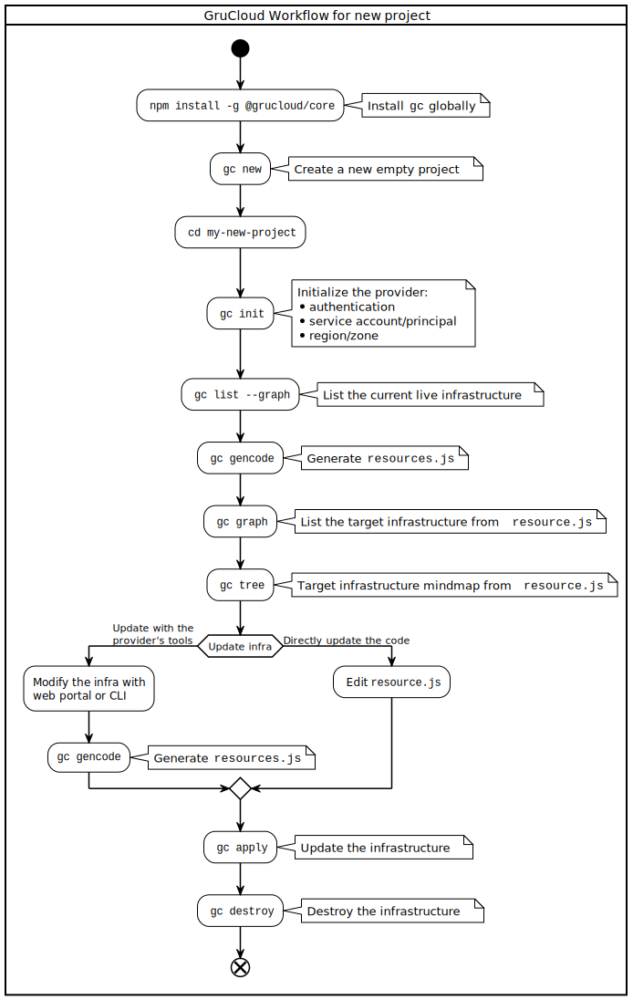

This document describes how to get started with GruCloud on the Google Cloud Platform.

## Use Cases


## Workflow



## Requirements

### GCP Account

Access to the [GCP console](https://console.cloud.google.com/home/dashboard) is required to run this tutorial.

### gcloud

Ensure the GCP CLI called [gcloud](https://cloud.google.com/sdk/docs/install) is installed:

```sh
$ gcloud -v
```

```txt
Google Cloud SDK 363.0.0
beta 2021.10.29
bq 2.0.71
core 2021.10.29
gsutil 5.4
```

### Node.js

GruCloud is written in Javascript running on [Node.js](https://nodejs.org)

Verify the presence of _node_ and check the version:

```sh
node --version
```

Any version above 14 should be fine.

## GruCloud CLI

The GruCloud CLI called `gc` can be installed globally with NPM:

```sh
npm i -g @grucloud/core
```

As a sanity check, display the version with:

```sh
gc --version
```

That's all for these requirements.

### `gc new` Create a new project

The **new** command guides you on how to create and configure a new project.


Below is the screencast of **gc new**:

 <div>
    <iframe
    data-autoplay
    src="https://asciinema.org/a/lskiblzLpXqnPsZ5Z1W7Bf2Kd/embed?autoplay=true&amp;speed=1&amp;loop=true"
    id="asciicast-iframe-13761"
    name="asciicast-iframe-13761"
    scrolling="no"
    style={{ width: "900px", height: "600px" }}
    ></iframe>
</div>
            
The boilerplate project is now created and configured.

### `gc init` Initialisation

A few actions need to be performed before deploying the resources.

- Setup billing for that project
- Enable the API services
- Create a service account
- Create and save the credential file for this service account
- Update the IAM policy by binding roles to the service account

Don't worry, these preparation steps are fully automated:

```sh
gc init
```

<div>
    <iframe
    data-autoplay
    src="https://asciinema.org/a/7ZjVCYhCV5IpFJix3o8MWCfpm/embed?autoplay=true&amp;speed=1&amp;loop=true"
    id="asciicast-iframe-13761"
    name="asciicast-iframe-13761"
    scrolling="no"
    style={{ width: "900px", height: "600px" }}
    ></iframe>
</div>

### `gc list` List the live resources

Visualize your current infrastructure with the _list_ command:

```sh
gc list --graph
```


### `gc gencode` Code Generation

Here we assume some resources are already deployed.

```sh
gc gencode
```

This command fetches the resources inventory and generated the code in _resource.js_.

<div>
    <iframe
    data-autoplay
    src="https://asciinema.org/a/cG8dNLRpUbjcpGmg1HajmZdcJ/embed?autoplay=true&amp;speed=1&amp;loop=true"
    id="asciicast-iframe-13761"
    name="asciicast-iframe-13761"
    scrolling="no"
    style={{ width: "900px", height: "610px" }}
    ></iframe>
</div>

Congratulation, the infrastructure code has been created automatically.

### `gc graph` Target Graph

The _graph_ command creates a dependency graph of the target resources:

```sh
gc graph
```


### `gc tree` Resource mind map

Given the target resources defined in _resources.js_, let's generate a mindmap of the target resources by group and type.

```sh
gc tree
```


### `gc apply` Update

To update the infrastructure, either use the GCP console and run **gc gencode**, or modify directly the file **resource.js**.
Once done, use the **apply** command to update the infrastructure:

```sh
gc apply
```

<div>
    <iframe
    data-autoplay
    src="https://asciinema.org/a/0VjCmyE8bW8Jq4FdEnFxyjaFd/embed?autoplay=true&amp;speed=1&amp;loop=true"
    id="asciicast-iframe-13761"
    name="asciicast-iframe-13761"
    scrolling="no"
    style={{ width: "900px", height: "640px" }}
    ></iframe>
</div>

### `gc destroy` Destroy

To destroy the infrastructure, use the _destroy_ command:

```sh
gc destroy
```

<div>
    <iframe
    data-autoplay
    src="https://asciinema.org/a/Rla0m3E70stbH5faMTS5ZWAIw/embed?autoplay=true&amp;speed=1&amp;loop=true"
    id="asciicast-iframe-13761"
    name="asciicast-iframe-13761"
    scrolling="no"
    style={{ width: "900px", height: "640px" }}
    ></iframe>
</div>

## Next Steps

- Browse the various [examples](https://github.com/grucloud/grucloud/tree/main/examples/google) which helps to find out how to use this software.

- Available [GCP Resources](./GcpResources.md)
