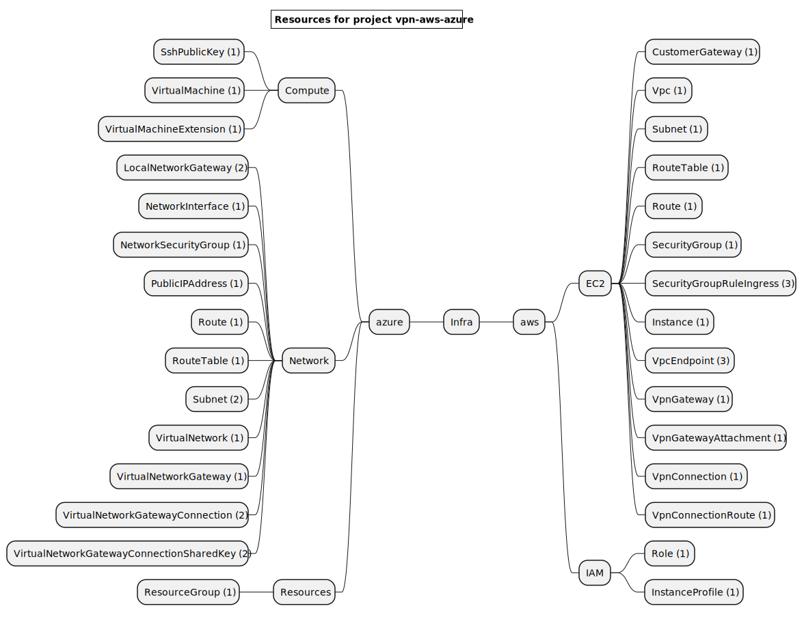
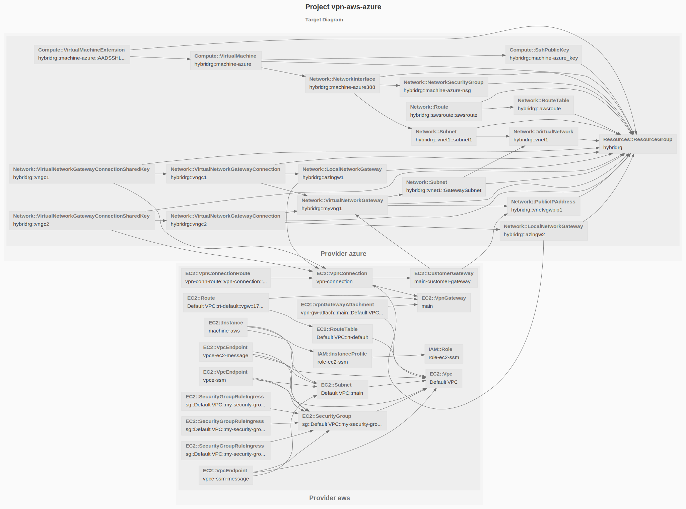

# VPN between Azure and AWS

This example deploys a VPN tunnel between AWS and Azure.





# ClickOps - Manual Steps

### AWS VPN Part 1

#### AWS VPC - Subnets - Routes

- Visit the [AWS VPC page](https://console.aws.amazon.com/vpc/home?#vpcs:)
- Click `Create VPC`
- Select `VPC and more`
- Choose a name prefix or set it empty.
- In this example, select just one private subnet
- Finally click on `Create VPC`

#### AWS Virtual Private Gateway

- Visit the [AWS Vpn Gateways page](https://console.aws.amazon.com/vpc/home?#VpnGateways:)
- Click on `Create virtual private gateway`
- Enter a name such as `vpg-azure`
- Click on `Create virtual private gateway`

#### AWS Attach VPC to VPG

- Select the newly created virtual private gateway,
- Click on `Actions` and select `Attach to VPC`
- Select the previously created vpc from the dropdown menu
- Click on `Attach to VPC`

The state should move from `Attaching` to `Attached`

### Azure VPN Part 1

#### Azure Virtual Network

#### Azure Virtual Network Gateway

### AWS VPN Part 2

#### AWS Customer Gateway

- Visit the [AWS customer gateway page](https://console.aws.amazon.com/vpc/home?#CustomerGateways:)
- Click on "Create customer gateway"
- Enter a name such as `cw-azure`
- Paste the azure ip address to the `IP address` input
- Finally, click on `Create Customer Gateway`

#### AWS Route

- Visit the [AWS Route Tables page](https://console.aws.amazon.com/vpc/home?#RouteTables:)
- Select the private route table
- Click on the `Routes` tab
- Click on the `Edit` button
- Click on `Add Routes`
- Enter the google subnet CIDR range as the destination such as `192.168.0.0/24`
- Select the _Virtual Private Gateway_ as the target
- Click on `Save Changes`

#### AWS VPN Connection

- Visit the AWS [Site-to-Site VPN Connections](https://console.aws.amazon.com/vpc/home?#VpnConnections:)
- Click on `Create VPN Connection`
- Select a name such as `vpn-gcp`
- Select the previously created virtual private gateway from the dropdown
- Select the previously created customer gateway from the dropdown
- From the routing options, select `Static`
- In Static IP prefixes, enter the the CIDR from the previously created google subnet such as `192.168.0.0/24`
- Click on `Create VPN Connection`

The pre-shared keys for the 2 tunnels cannot be retrieved from the console, let's use the AWS CLI to retrieve the preshared keys

```sh
aws ec2 describe-vpn-connections
```

Search the relevant `PreSharedKey` and `OutsideIpAddress` for a given tunnel. This keys and ip addresses will be used to create the GCP Virtual Network Gateway.

### Azure VPN Part 2

#### VirtualNetworkGateway

#### LocalNetworkGateway

#### VirtualNetworkGatewayConnection

### AWS EC2 instance

#### AWS Role for EC2

- Visit the [AWS roles page](https://console.aws.amazon.com/iamv2/home?#/roles)
- Click on `Create Role`
- Choose `EC2` in _Common use cases_
- Click on `Next`
- Search the `AmazonSSMManagedInstanceCore` policy
- Select this policy
- Click on `Next`
- Enter a role name such as `role-ec2-ssm`
- Click on `Create Role`

#### EC2 Security Group

- Visit the [AWS EC2 Security Groups page](https://console.aws.amazon.com/ec2/home?#SecurityGroups:)
- Click on `Create security group`
- Enter a name for the security group, for instance `my-security-group`
- Enter a description
- Select the vpc previously created
- Add an HTTPS ingress rule required by the System Manager
- Add an ICMP rule for responding to ping request.

#### EC2 VPC Endpoint

| Endpoint name     | Service                                      |
| ----------------- | -------------------------------------------- |
| vpce-ssm          | `com.amazonaws.${config.region}.ssm`         |
| vpce-ssm-messages | `com.amazonaws.${config.region}.ssmmessages` |
| vpce-ec2-messages | `com.amazonaws.${config.region}.ec2messages` |

- Visit the [AWS VPC Endpoint page](https://console.aws.amazon.com/vpc/home?#Endpoints:)
- Click on _Create endpoint_
- Enter the name of the endpoint
- Search for the service
- Select the service
- Select the VPC
- Select the Subnets
- Select the previously created security group
- Click on `Create Endpoint`

#### AWS EC2 instance

- Visit the [AWS EC2 instances page](https://console.aws.amazon.com/ec2/home?#Instances:)
- Click on `Launch Instances`
- Enter a machine name such as `machine-aws`
- Edit network settings
- Select the VPC that was created
- Select `Select existing security group`,
- Choose the security group previously created
- In _Advanced details_, select the previously created role from the _IAM Instance profile_ dropdown.
- Click on `Launch Instance`
- Select `Proceed without keypair`
- Finally click on `Launch Instance` one more time

# Workflow

Here are the steps to deploy, destroy and document this infrastructure:


